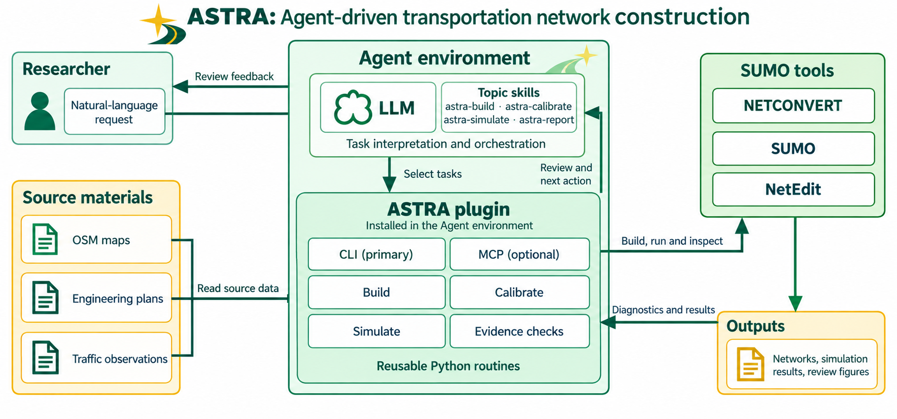
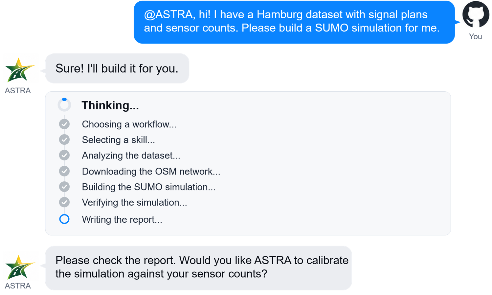

<p align="center">
  
</p>

# ASTRA

[](https://doi.org/10.5281/zenodo.22899011)

<p align="center">
  <strong>Automated Simulation of TRAnsportation networks for SUMO</strong>
</p>

<p align="center">
  ASTRA turns real-world traffic data and natural-language tasks into SUMO simulations.
</p>

<p align="center">
  <a href="docs/codex-plugin-install.md">Installation</a> ·
  <a href="docs/README.md">Documentation</a> ·
  <a href="examples/01_signal_control_audit/task.md">Examples</a> ·
  <a href="LICENSE">MIT License</a>
</p>

<p align="center">
  <a href="README.md">English</a> ·
  <a href="docs/readme/README.zh-CN.md">简体中文</a> ·
  <a href="docs/readme/README.de.md">Deutsch</a>
</p>

<p align="center">
  
</p>

## What ASTRA Does

<table>
<tr>
<td width="33%" valign="top">
<h3>Build</h3>
Build SUMO networks from OpenStreetMap, vehicle trajectory data, and road construction maps.
</td>
<td width="33%" valign="top">
<h3>Calibrate</h3>
Reconstruct traffic demand and calibrate simulations using real sensor measurements.
</td>
<td width="33%" valign="top">
<h3>Simulate</h3>
Run further SUMO experiments from natural-language instructions.
</td>
</tr>
</table>

## How ASTRA Works in Codex

<p align="center">
  
</p>

## Quick Start

```powershell
codex plugin marketplace add Tarard/ASTRA-SUMO --ref main
codex plugin add astra-sumo@astra-sumo
```

Then ask Codex, for example:

```text
Use ASTRA to build a SUMO network from this OSM area.
Check connectivity, traffic signals, and routeability.
```

ASTRA requires Python 3.11+ and Eclipse SUMO.

ASTRA continues Torii in this new repository. See the
[migration guide](docs/astra-migration.md) for installation changes and compatibility.

## Hamburg Digital Twin

ASTRA is being used to reconstruct and validate a real traffic corridor in central Hamburg.

<p align="center">
  
</p>

<p align="center"><sub>ASTRA V1 corridor over aerial imagery, with lane connections and virtual sensors.</sub></p>

ASTRA combines official traffic data, aerial imagery, and SUMO network reconstruction in one workflow.

<p align="center">
  
</p>

<p align="center"><sub>LSA118 reconstruction: official MAP endpoints and headings, reconstructed curves, and lane connections before and after cleaning.</sub></p>

The current Hamburg calibration matches the aggregate detector count exactly, with **0.15 vehicles MAE per 15-minute bin**.

## Documentation

[Architecture](docs/architecture.md) ·
[Installation](docs/codex-plugin-install.md) ·
[Documentation](docs/README.md) ·
[Examples](examples/01_signal_control_audit/task.md)

## License

ASTRA-SUMO is licensed under the [MIT License](LICENSE).

ASTRA 1.3.1 is archived on [Zenodo](https://doi.org/10.5281/zenodo.22899012).
The [project DOI](https://doi.org/10.5281/zenodo.22899011) covers all ASTRA versions.

Earlier Torii releases remain in their [original Zenodo archive](https://doi.org/10.5281/zenodo.20627975).
